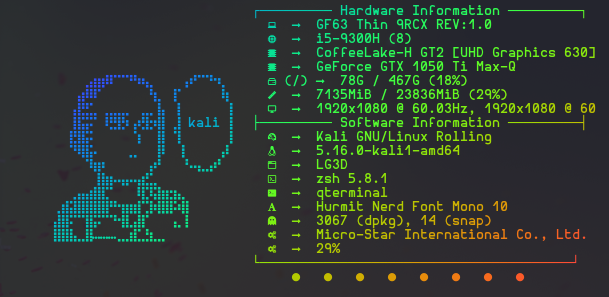

#### [Home](./) [Content](./page2.html) [About](./about.html)

## About me

#### WHOAMI

*   Name: `Alvaro Gonzalez`
*   Location: `America/Santiago`
*   Year of Creation: `1992`
*   Employed: `True`
*   Looking for new oportunities: `True`
*   Tecnologies: `['Python','JS','PHP','Laravel','Flask','React','ExpressJs','C#','Git','Dockers','GoLang','Kafka']`
*   Raspberry Services: `1`
*   Terminal lvl: `Advanced`
    
